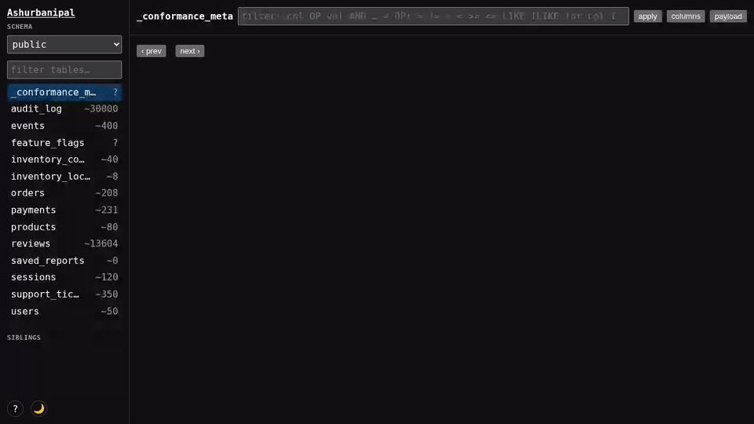

# Ashurbanipal

No-bullshit Database browser for schemaful databases — self-contained, embeddable, read-only. No separate DB client, no extra credentials, no build step.

## Why

90% of engineers just want to browse their database. Having such functionality in a corporate environment currently means:

- Did you request AWS access? Wait for approval.
- Approved? Now add your username and SSH key to a repo nobody's heard of, and wait for *that* owner to approve you too.
- Follow a Confluence page to wire up AWS + SSH + your pick of DBeaver/pgcli/psql/pgAdmin/TablePlus.
    - ssh timeout out, oh too bad, you should use `mosh` instead
- Get your session killed by fucking Okta re-auth every 4 hours. Repeat.
    - blindly accept the MFA prompt, or else your session dies and you have to start over
- The bastion host is being patched, so none of the above even works.
- "You don't need to have db access, you just need to slice your stories thinly enough so you can test your code without needing db access" a wise engineer in an unwise org.
- can't deploy a sidecar container to run a db client, because the security team says no

all I need is to just see a row in the db, so I can complete my jira story.

Ashurbanipal lib skips the whole chain by not needing a new connection, it runs inside the process that already has one. If your service can query its own database, then you can look at a table from your browser.

## What it does

- Lists tables and filter table rows with a subset of SQL `WHERE` syntax (no joins, no subqueries, no CTEs, no DML).

## What it doesn't do

- No write access, no migrations, no schema changes.
- Not a replacement for a full-featured DB client like DBeaver, pgcli etc

## where it should be used

- In a corporate vpn environment, where engineers have to jump through hoops to get access to the database.

if you have the freedom to run a sidecar container, you can use `pgweb` instead, which is a full-featured DB client.

## Usage

See each implementation's own README for install and config instructions
— e.g. `implementations/rust/README.md` for the Rust/Axum crate.

See `docs/design.md` for the full API contract, filter DSL, and config
reference.

## Implementations

The canonical artifact of this project isn't any one backend — it's
`frontend/dbviewer.html` plus the contract it's served against
(`spec/protocol.md` + `spec/openapi.yaml`). The Rust crate above is the
reference implementation of that contract, not a privileged one.

If your service isn't Rust/Axum/Postgres, you have two options, in this
order:

1. **Port it.** `PORTING.md` is the full checklist: vendor the released
   `dbviewer.html`, implement the five API routes per the spec, pass
   conformance. This repo doesn't (and won't try to) ship a first-party
   implementation for every language/framework/DB combination — a port
   for your stack is expected to live in your own service or org, using
   the spec and docs as the contract, not as a request against this repo.
2. **No time to port? Use a sidecar instead**, e.g. `pgweb`
   (`docker run sosedoff/pgweb --readonly`) pointed at the same DB. It
   can't join the sibling mesh or share the DSL/UI, and it allows
   arbitrary `SELECT` rather than the schema-validated subset this
   project exposes — but it needs zero code. See `PORTING.md` for the
   fuller comparison.

A first-party port only gets added to the table below once it's actually
built and passes conformance in its own CI — new-stack requests are
better spent as a port PR than an issue asking for support.

Every implementation below implements the same `spec/protocol.md` +
`spec/openapi.yaml` contract and vendors the same `frontend/dbviewer.html`
(`PORTING.md`); none is structurally privileged over another
(`docs/design.md` §4.2, `roadmap.md` §2). "Conformant" means both
conformance layers — the golden-fixture behavior runner and the
schemathesis/equivalent shape check (`PORTING.md`) — pass in that
implementation's own CI.

| Implementation | Language / framework | Protocol version | Conformance CI |
|----------------|-----------------------|-------------------|-----------------|
| [`rust`](implementations/rust/README.md) | Rust / Axum | 1 | `.github/workflows/rust-conformance.yml` |
| [`spring-boot-starter`](implementations/spring-boot-starter) | Kotlin / Spring Boot (autoconfiguration starter) | 1 | `.github/workflows/spring-boot-conformance.yml` |
| [`go-nethttp`](implementations/go-nethttp/README.md) | Go / `net/http` (framework-agnostic library) | 1 | `.github/workflows/go-conformance.yml` |
| [`node-express`](implementations/node-express/README.md) | Node.js / TypeScript / Express | 1 | `.github/workflows/node-conformance.yml` |
| [`flask-python`](implementations/flask-python/README.md) | Python / Flask | 1 | `.github/workflows/flask-conformance.yml` |
